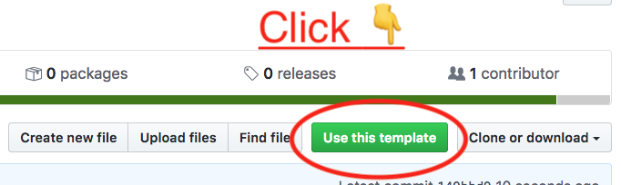

Please click "Use this template" button to create your own repository based off this one. This repository aims to get an organisation off the ground using Terraform with Google Cloud.

Required:

- Google command line tools from SDK https://cloud.google.com/sdk/
- A Google Cloud account with an Organisation configured https://console.cloud.google.com/cloud-resource-manager.
- Make

====================================
Terraform and Google Template Set up
====================================

.. contents::

Terraform Usage
---------------

Change into the terraform directory to run the commands. Now you can use ``make`` to do ``plan, apply, init, ...`` and other actions.

Authentication
~~~~~~~~~~~~~~

You will need to login in order to be able to run terraform commands. The <your org name> set up will show the configuration needed for this to work.

.. code-block:: bash

	# Once-off set up:
	gcloud config configurations create <your org name>

	# Each time you reboot or use another company's set up on gcloud.
	gcloud config configurations activate <your org name>
	gcloud auth application-default login

Terraform Once-off Set up
~~~~~~~~~~~~~~~~~~~~~~~~~

Please rename the file template_env_mk to env.mk and set the values for the environment variables:

``REGION``: This can be any valid region from https://cloud.google.com/compute/docs/regions-zones/

``GCLOUD_ORG_ID``: From https://console.cloud.google.com/cloud-resource-manager get the ID value shown.

``GCLOUD_BILLING_ID``: From https://console.cloud.google.com/billing you will see the "Billing account ID" column for the billing account you wish to use.

``TF_ADMIN``: The name of the Google Project which will be used only by Terraform. This does not have to exist and will be created if its not present. For example TF_ADMIN=<my org name>-terraform-admin

``TF_CREDS``: The name and path of the Terraform JSON credentials. This file will be created for you. For example TF_CREDS=${HOME}/.config/gcloud/<my org name>-terraform-credentials.json

Start by setting up the admin project and admin service account creation.

.. code-block:: bash

	make init

Start by setting up the admin project and admin service account creation.

.. code-block:: bash

	make admin-project service-account

Next enable the google APIs I think I'll need. This can be added to and re-run and was based on previous google cloud projects.

.. code-block:: bash

	make enable-apis

Now I need to enable the permissions from

.. code-block:: bash

	make org-and-folder-permissions

Now the shared state needs to be set up. This allows others to run terraform using the same state. **``NOTE``**: Only once person should run at a time as it is not safe to run in parallel

.. code-block:: bash

	make init-terraform-state-store

Finally, we now need to get the service account key to be able to terraform. I put this key into 1Password under "myorg Systems GCloud R&D account". Edit the following file and put the JSON contents into it.

.. code-block:: bash

	vi ~/.config/gcloud/<your org name>_tfadmin_credentials.json
